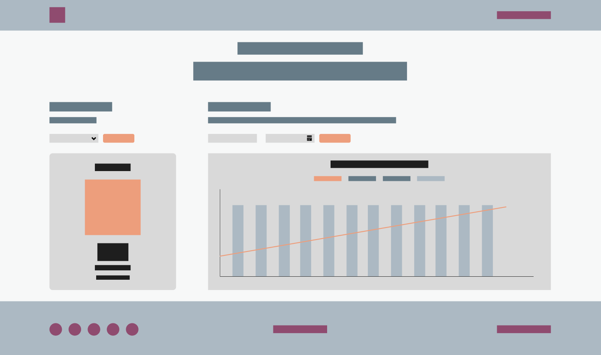
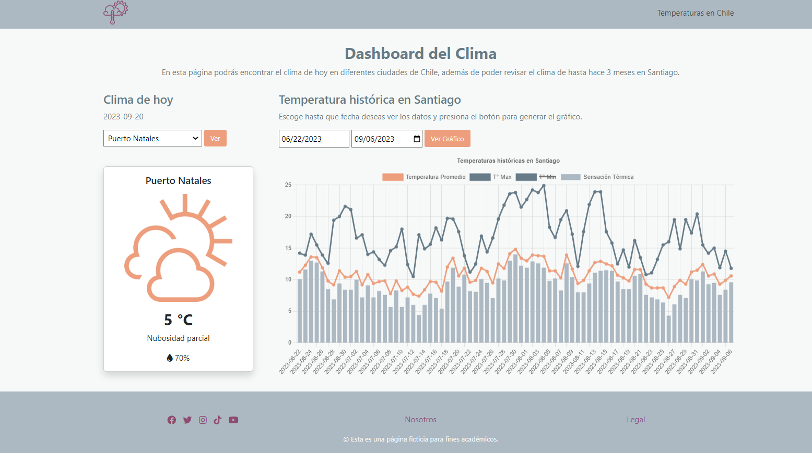

Proyecto : Dashboard
# **Dashboard del Clima**

## **Descripción:**
El proyecto consiste en crear una página web que contenga un dashboard (tablero de datos), en donde se puedan visualizar diferentes datos recogidos desde una API, y que se muestren de manera visual a través de diferentes gráficos. En este caso, se eligió crear una página que muestre información sobre el clima.

Para el desarrollo del proyecto, lo primero que se hizo fue un prototipo visual de la página web.

En la página se muestra una pequeña descripción de bienvenida para luego pasar a mostrar los datos. 

En el lado izquierdo se muestra una select con diferentes ciudades para escoger y una card que muestra los datos de esa ciudad (nombre, icono, temperatura, estado y humedad).

Al lado de esto, inicialmente se muestra un selector de fechas de hasta un máximo de 90 días y un botón que genera un gráfico con el rango especificado, en donde se muestran datos históricos del clima de Santiago (temperatura promedio, sensación térmica, temperatura máxima y mínima).

## **Features:**
Para el desarrollo del proyecto se utilizaron diferentes tecnologías, tales como:
- Aplicación Figma: Para el desarrollo del diseño inicial de la página web.
- Bootstrap: Incorporación de variados componentes del framework para agilizar el desarrollo del prototipo.
- Fontawesome: Para la incorporación de diferentes íconos.
- Node.js: Para la creación de un entorno de desarrollo.
- Chart.js: Incorporación de gráficos.
***
#### **API:**
En este proyecto, se utilizaron 2 API para obtener diferentes datos sobre el clima:
1. API de GAEL (https://api.gael.cloud/?shell#publica): Para datos del clima del día en diferentes ciudades en Chile.
2. Open-Meteo (https://open-meteo.com/): Para datos históricos sobre el clima en Santiago.

#### **Javascript:**
Se utilizan 4 funciones principales para el funcionamiento del proyecto:
1. Función Datos Actuales: Aquí se toman los datos del clima del día para luego pasarlos a una card.
2. Función Gráfico: Toma los datos históricos del clima de un determinado rango de fechas y los muestra en un gráfico.
3. Función Actualizar: Renueva el gráfico creado de acuerdo a un nuevo rango de fechas entregado.
4. Función Cambio: Escucha cuando se produce un cambio en la ciudad seleccionada y muestra los nuevos datos.

## **Objetivos:**
El proyecto se enfoca en la creación de un dashboard con los siguientes objetivos:
1. Uso de Node.js.  
2. Aplicar modularización (import y export).  
3. Consumo de API.  
4. Aplicar procesos asincrónicos.  
5. Uso de Chart.js

## **Demo:**
A continuación, se presenta un enlace a la demo del proyecto.

https://ferramirez99.github.io/Proyecto3/